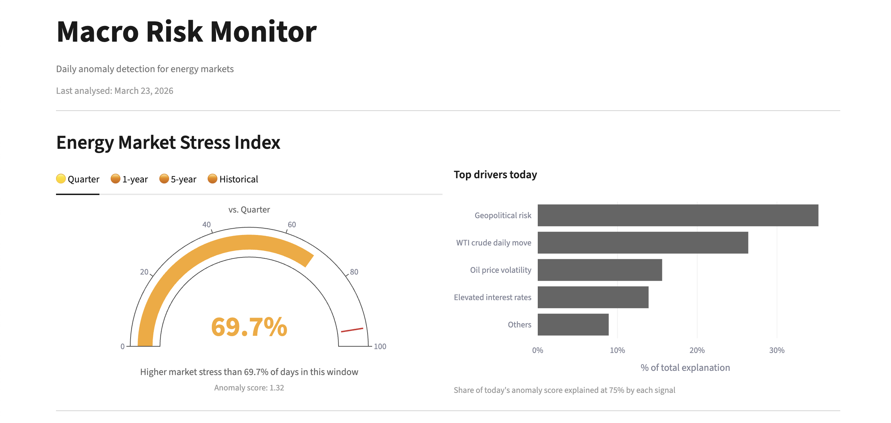

# Macro Risk Monitor

Daily anomaly detection for energy markets. Monitors 21 signals across oil and gas prices, equity markets, macroeconomic indicators, and geopolitical risk to detect unusual market conditions as they emerge.

**[Live Dashboard →](https://macro-risk-monitor.streamlit.app/)**

---

## What it does

Each trading day, the pipeline:
1. Ingests fresh data from three sources — energy prices (yfinance), macroeconomic indicators (FRED), geopolitical risk index (AI-GPR)
2. Engineers 21 features across price, macro, and geopolitical signal blocks
3. Combines three signals into a daily anomaly score
4. Stores results and serves them through an interactive dashboard

The dashboard answers one question: **is today's energy market environment unusual, and if so, why?**

---

## Anomaly detection approach

Three complementary signals, each detecting a different type of anomaly:

| Signal | Type | Detects |
|---|---|---|
| Isolation Forest | Trained model | Multi-dimensional structural anomalies |
| Rolling z-score | Statistical signal | Univariate distributional deviations |
| Change point (ruptures) | Algorithmic signal | Regime shifts over time |

Scores are combined into a single daily anomaly score using fixed weights (0.4 / 0.35 / 0.25). Only IsolationForest has learnable parameters — z-score and change point are deterministic signal processors applied consistently each day.

Feature attribution covers 75% of the score — the IsolationForest component via SHAP TreeExplainer, and the z-score component via per-feature statistical deviation. The remaining 25% from change point detection is not decomposable to individual feature contributions.

---

## Threshold design

The anomaly threshold is adaptive, not static. For each time window, the threshold is the 95th percentile of scores within that window. This means "anomalous" is always defined relative to recent conditions — a day that would be unremarkable in 2008 may be anomalous in a calm 2015 market, and vice versa.

The 5-year window is grounded in geopolitical policy cycles: within 5 years, a US administration changes or renews, a Chinese Five Year Plan completes, and OPEC+ has renegotiated its framework. The world is meaningfully different beyond this horizon.

---

## Validated against known crises

| Event | Flagged |
|---|---|
| 2008 Financial crisis | ✓ |
| 2010 Flash Crash | ✓ |
| 2011 Arab Spring / US debt ceiling | ✓ |
| 2019 Abqaiq drone attack | ✓ |
| 2020 COVID crash | ✓ |
| 2021 Omicron | ✓ |
| 2022 Russia-Ukraine invasion | ✓ |
| 2023 SVB collapse, Hamas attack | ✓ |
| 2024 Iran-Israel escalation | ✓ |
| 2025 Tariff shock | ✓ |
| 2026 US-Israel strikes on Iran | ✓ |

---

## Stack

| Layer | Tool | Why |
|---|---|---|
| Orchestration | GitHub Actions | Zero-infrastructure daily batch |
| Raw storage | AWS S3 (parquet) | Durable append-only source data |
| Feature storage | AWS S3 + DuckDB | Fast local OLAP on scored output |
| Market calendar | exchange_calendars | NYSE holiday handling |
| ML | scikit-learn IsolationForest | Trained anomaly detection component |
| Z-score | pandas rolling | Deterministic statistical deviation signal |
| Change point | ruptures Pelt RBF | Deterministic regime shift signal |
| Experiment tracking | MLflow | Params, metrics, model artifacts |
| Dashboard | Streamlit + Plotly | Primary output layer |

---

## Data sources

| Source | Data | From |
|---|---|---|
| yfinance | WTI, nat gas, XLE, XOP, OVX, VIX | 2007 |
| FRED | Brent, fed rate, yield curve, HY spread, DXY, CPI | 1987 |
| AI-GPR (Iacoviello & Tong, 2026) | Geopolitical risk index, oil-specific sub-index | 1985 |

---

## Known limitations and future development

**Current limitations:**
- Geopolitical risk index (AI-GPR) has a publication lag — the fallback mechanism partially compensates but recent geopolitical events may be underrepresented in the score.
- Training window starts in 2007, bounded by OVX inception — the 2008 crisis is less well-represented in volatility features than later crises
- Change point detection contributes 25% of the anomaly score but cannot be decomposed to individual feature contributions
- The model is retrained daily on the full window — there is no concept drift detection or model versioning beyond MLflow logging

**Planned improvements:**
- Monitor AI-GPR publication frequency and evaluate alternative geopolitical data sources if updates become insufficient
- Adaptive contamination parameter — currently fixed at 5%, could be estimated from the rolling anomaly rate
- Full feature attribution — decompose change point contributions alongside IsolationForest and z-score
- Alert system — email or Slack notification when any anomaly flag is triggered
- Extended data sources — natural gas storage, tanker tracking data, energy equity options flow
- REST API — expose daily scores and historical data programmatically for integration with other systems

---

## References

Iacoviello, M. and Tong, J. (2026). "The AI-GPR Index: Measuring Geopolitical Risk using Artificial Intelligence." Working Paper, Federal Reserve Board of Governors.

---

## Author
Aleksej Talstou  
[LinkedIn](https://www.linkedin.com/in/aliaxey-talstou/) | [GitHub](https://github.com/altal3000)